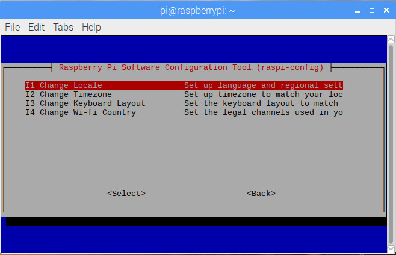
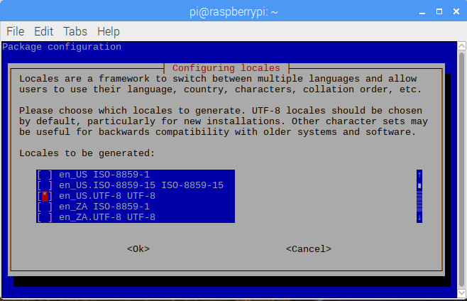
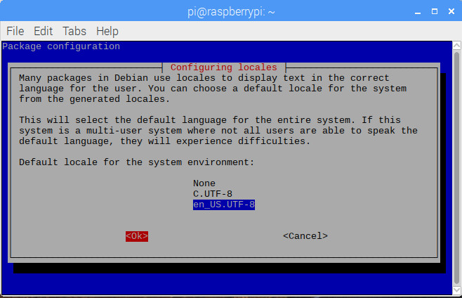
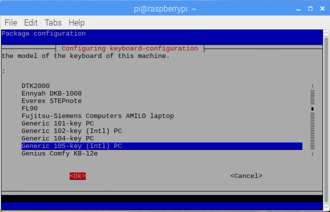
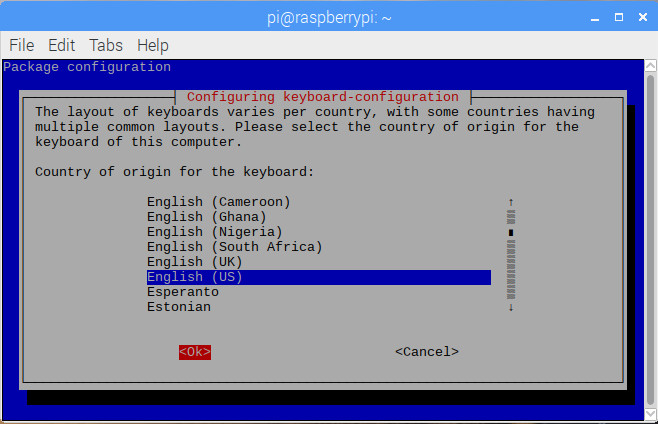

# 1.4 Raspberry Pi Configuration

## 1.4.1 raspi-config
[**raspi-config**](https://www.raspberrypi.org/documentation/configuration/raspi-config.md) is the Raspberry Pi configuration tool specifically for the Raspberry Pi.
Command
```
sudo raspi-config
```
will pop up the following configuration page:


There are 9 items in total, and four of them, are to be configured:
* 4 Localisation Options: Set up language and regional settings
* 5 Interfacing Options: Configure connections to periphery devices
* 7 Advanced Options: Configure advanced settings
* 8 Update: Update this tool to the latest vesion firmware


## 1.4.2 Localisation Configuration
After having selected **4 Localisation Options**, you will be able to see the following page:



From **NOW** on, we are going to change **Locale**, **Timezone**, **Keyboard Layout**, as well as **Wi-fi Country** one by one.


* **Locales**

**en_GB.UTF-8 UTF-8** is enabled as the default locales settings:


Since the author is at Vancouver, Canada, North America, while writing this gitbook, we need to make sure  **en_US.UTF-8 UTF-8** is enabled, to take the place of **en_GB.UTF-8 UTF-8**, which is supposed to be ticked **OFF** instead.



After selecting **OK**, the following page is popped up:



Then, press **OK** again, and we fill finish the system locale settings.


* **TimeZone**

Users should set their own TimeZone. In our case, **America** and **Vancouver** are respectively seletect as the **Geographic area** and **Time zone**, as follows:


Then, press **OK** again, and we fill finish the system timezone settings.


* **Keyboard Layout**

A correct Keyboard Layout also needs to be correctly configured.






* **Wi-fi Country**


<!-- **dpkg-reconfigure** is to reconfigure an already installed package. **dpkg-reconfigure** is **NOT** specific for Raspberry Pi.

* **dpkg-reconfigure tzdata**: **tzdata** refers to **time zone data**.
* **dpkg-reconfigure locales**: **locales** is for localization and language configuration.
* **dpkg-reconfigure keyboard-configuration**: clearly, **keyboard-configuration** is for keyboard configuration. -->


## 1.4.3 Interface Configuration

## 1.4.4 Advanced Settings

## 1.4.5 Firmware Updating
